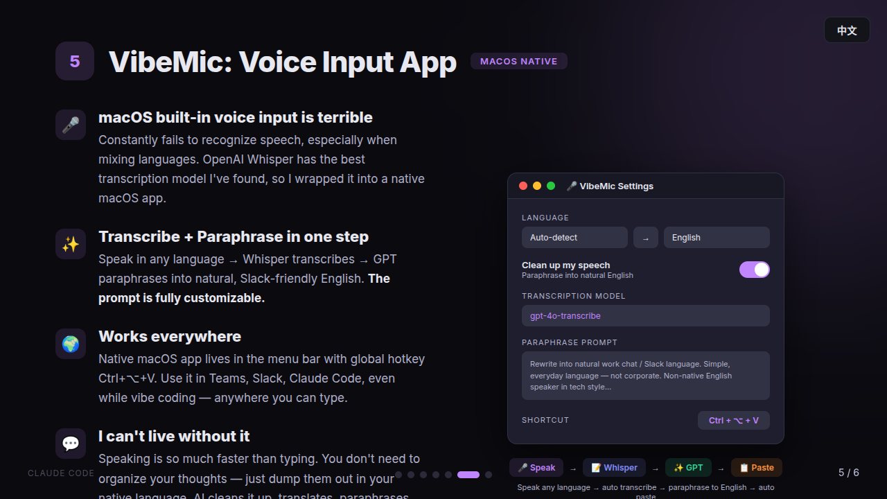

# VibeMic Native (macOS)

[中文版](#中文) | English



System-wide voice-to-text for macOS. Press a hotkey to record, release to transcribe with OpenAI Whisper and instantly paste into any app.

## How it works

1. Press `Ctrl+Option+V` — recording starts, floating overlay appears
2. Press again (or click STOP) — audio is sent to OpenAI Whisper
3. Transcribed text is pasted into your currently focused app

## Features

- **Native Swift app** — no Python, no Electron, no dependencies
- **Menu bar + Dock** — idle, recording, transcribing, paraphrasing states
- **Global hotkey** — customizable via Settings (default: Ctrl+Option+V), registered via Carbon API — no accessibility permission needed for the hotkey itself
- **Floating overlay** — red pill-shaped recording indicator with pulsing dot and STOP button
- **Auto-paste** — copies to clipboard, optionally auto-pastes via ⌘V (requires Accessibility permission)
- **AI paraphrase** — rewrite transcription into natural Slack/work chat style before pasting
- **Translation** — translate output to 15+ languages (English, 繁體中文, 日本語, etc.)
- **Transcript history** — browse, copy, and delete past transcriptions
- **Settings window** — API key, model, language, temperature, hotkey, paraphrase config
- **Multi-language** — Cantonese, English, Mandarin, Japanese, and 97+ other languages

## Requirements

- macOS 13.0 (Ventura) or later
- Swift 5.9+ (included with Xcode 15+)
- OpenAI API key

## Quick Start

```bash
# Clone
git clone https://github.com/agents-io/vibemic-native-macos.git
cd vibemic-native-macos

# Build
swift build -c release

# Create .app bundle
APP_DIR="VibeMic.app/Contents"
mkdir -p "$APP_DIR/MacOS" "$APP_DIR/Resources"
cp .build/release/VibeMic "$APP_DIR/MacOS/VibeMic"
cp VibeMic/Resources/Info.plist "$APP_DIR/Info.plist"
cp VibeMic/Resources/VibeMic.entitlements "$APP_DIR/Resources/"

# Codesign (required for microphone access)
codesign --force --deep --sign - \
  --entitlements VibeMic/Resources/VibeMic.entitlements \
  VibeMic.app

# Run
open VibeMic.app
```

## Configuration

Click the menu bar icon to access Settings:

| Setting | Description |
|---------|-------------|
| API Key | Your OpenAI `sk-...` key |
| Model | `whisper-1`, `gpt-4o-transcribe`, `gpt-4o-mini-transcribe` |
| Language | Auto-detect or specify (en, zh, ja, ko, etc.) |
| Prompt | Hint text for Whisper (e.g. expected languages) |
| Temperature | 0 (deterministic) to 1 (creative) |
| Shortcut | Click to capture a new global hotkey |
| Paraphrase | Toggle AI rewriting with customizable system prompt |
| Translate to | Translate output to a target language |

Settings and history are saved as `config.json` and `history.json` next to the `.app` bundle.

Alternatively, create a `.env` file next to the app:

```
OPENAI_API_KEY=sk-your-key-here
```

## Auto-Insert (optional)

By default, VibeMic copies transcribed text to your clipboard. To enable automatic pasting:

1. Open **System Settings → Privacy & Security → Accessibility**
2. Add VibeMic.app and toggle it ON
3. Restart VibeMic

## Related

- [VibeMic Native Ubuntu](https://github.com/agents-io/vibemic-native-ubuntu) — Ubuntu/Linux version

## License

MIT

---

<a name="中文"></a>
## 中文


全系統語音轉文字 macOS 應用。按快捷鍵錄音，鬆開後自動用 OpenAI Whisper 轉錄，並即時貼上到任何應用程式。

### 運作方式

1. 按 `Ctrl+Option+V` — 開始錄音，浮動提示出現
2. 再按一次（或點擊 STOP）— 音訊傳送至 OpenAI Whisper
3. 轉錄文字自動貼上到你正在使用的應用

### 功能特色

- **原生 Swift 應用** — 無 Python、無 Electron、無依賴
- **Menu Bar + Dock** — 閒置、錄音中、轉錄中、改寫中狀態
- **全域快捷鍵** — 可在設定中自訂（預設：Ctrl+Option+V）
- **AI 改寫** — 將轉錄內容改寫成自然的 Slack/工作聊天風格
- **翻譯** — 輸出可翻譯為 15+ 種語言
- **轉錄記錄** — 瀏覽、複製、刪除過往的轉錄
- **多語言支援** — 廣東話、英文、普通話、日文等 97+ 種語言

### 快速開始

```bash
git clone https://github.com/agents-io/vibemic-native-macos.git
cd vibemic-native-macos
swift build -c release
```

詳細建置步驟請參考上方英文版。
